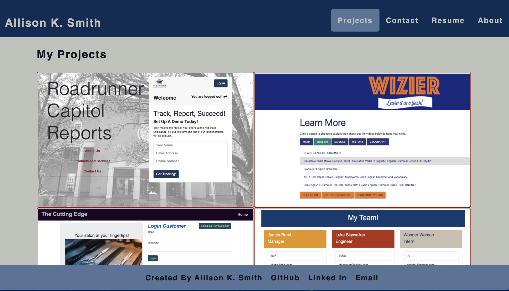

# My Portfolio

## Description
A React front end web portfolio of projects developed by Allison K. Smith. Includes about, contact, resume and project information. 

***
## Table of Contents
[Installation](#installation) 
[Usage](#usage) 
[Contributing](#contributing) 
[Tests](#tests) 
[License](#license) 
[Questions](#questions) 
***
## Installation
Deployed to github pages. Open in browser. 

## Usage
Website used to showcase web development work.

## Contributing

## Tests

## License
### This license is covered under the BSD license(s):
* BSD licenses are a family of permissive free software licenses, imposing minimal restrictions on the use and distribution of covered software.
***
## Questions
For more information contact me at: 
* Name: aksmith5239
* GitHub: https://github.com/aksmith5239/my-portfolio
* Email Address: aklobby@gmail.com